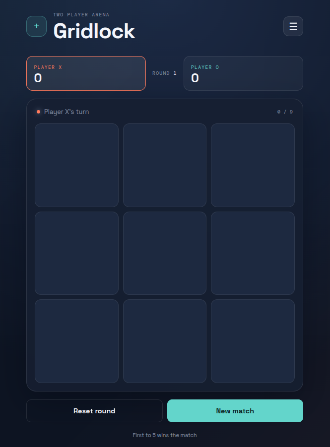

# Gridlock

> A polished, two-player Tic Tac Toe arena built with plain HTML, CSS, and JavaScript.

Gridlock turns the familiar 3x3 game into a focused local multiplayer experience with a live scoreboard, round flow, result celebrations, sound effects, and a pause menu. It is lightweight enough to open directly in a browser and simple enough to use as a front-end learning project.

## Features

- **Two-player local gameplay** for X and O
- **Live turn indicator** with the active player highlighted
- **Round scoreboard** that tracks wins for both players
- **Round counter** and move counter
- **Automatic win and draw detection**
- **Winning-line highlight** when a player completes a row, column, or diagonal
- **Congratulations result popup** after every completed round
- **Game menu** with resume, restart round, new match, sound, and pause controls
- **Sound effects toggle** using the included audio asset
- **Responsive layout** for desktop and mobile screens
- **Accessible controls** with labels, button semantics, and dialog states

## Preview

The game uses a dark game-arena visual style with contrasting coral X pieces, mint O pieces, responsive controls, modal feedback, and subtle motion.



## Play Locally

No framework, package manager, or build process is required.

### Option 1: Open directly

1. Download or clone this repository.
2. Open `index.html` in a modern web browser.
3. Start playing with two people on the same device.

### Option 2: Use VS Code Live Server

1. Open the project folder in VS Code.
2. Install the **Live Server** extension.
3. Right-click `index.html`.
4. Select **Open with Live Server**.

Using a local server is recommended while developing because it gives a more realistic browser environment and makes future asset or module changes easier to test.

## How to Play

1. Player X starts the round.
2. Players take turns selecting an empty square.
3. The first player to create three matching marks in a line wins the round.
4. If all nine squares are filled without a winning line, the round is a draw.
5. Use **Next round** to continue the match, **Reset round** to restart the board, or **New match** to clear the scoreboard.

## Project Structure

```text
GAME TIC TAC TOE/
├── index.html                         # Game layout and modal markup
├── style.css                          # Responsive visual design and animations
├── app.js                             # Game rules, state, score, and controls
├── assets/
│   ├── computer-mouse-click-352734.mp3 # Optional move sound effect
│   └── preview.png                     # README game preview image
└── README.md                          # Project documentation
```

## Technology

- HTML5
- CSS3
- Vanilla JavaScript
- Google Fonts: Space Grotesk and DM Mono
- No external JavaScript framework
- No database or server required

## Professional Repository Checklist

Before sharing the project publicly, make these small improvements:

- Keep `assets/preview.png` updated when the interface changes.
- Add a short live demo link near the top of this README.
- Add a repository description such as: `A polished two-player Tic Tac Toe game built with vanilla JavaScript.`
- Add relevant GitHub topics: `tic-tac-toe`, `javascript-game`, `vanilla-javascript`, `html`, `css`, `frontend`
- Keep commit messages specific, for example: `Add round result modal and score tracking`.
- Test the game on both a narrow mobile viewport and a desktop viewport.
- Confirm that the sound toggle, menu buttons, win popup, draw state, reset round, and new match actions all work before publishing.
- Add a license if you plan to accept contributions or allow reuse.

## Possible Next Improvements

- Add a single-player mode against an AI opponent.
- Add player name inputs instead of fixed X and O labels.
- Save match scores with `localStorage`.
- Add keyboard navigation for the board.
- Add theme selection and reduced-motion support.
- Add a small test suite for the win and draw rules.

## License

No license has been selected yet. Add a license file before presenting this project as reusable open-source software.
